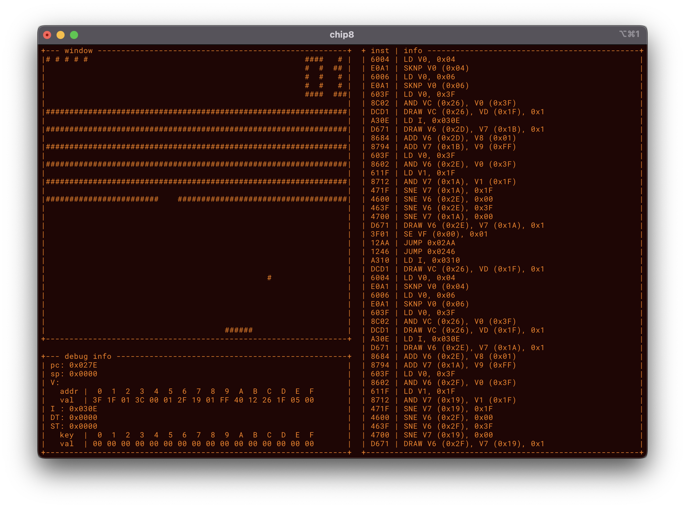

This repo. is implementation of [chip8 emulator](http://devernay.free.fr/hacks/chip8/C8TECH10.HTM) in Nim.

# Note
Obviously you need nim.  
If you don't have it, [install](https://nim-lang.org/install_unix.html) it.  
This repo was tested on >= 1.4.8, <2.0.0.

Currently, you need at least 128x47 space to see this program runnning.
This program will run in Unix/Linux-like systems because it uses termios to handle the output.

It seems some ROMs don't work as expected, have some bugs in the codes.

# ROMs
Some kind people are providing ROMs, please use those or create by yourself.
- https://github.com/kripod/chip8-roms

# Keys
To quit manually, press `ESCAPE`.

Input keys are replaced for keyboards.
```
original key:
  1 2 3 C
  4 5 6 D
  7 8 9 E
  A 0 B F

is mapped to
  1 2 3 4
  q w e r
  a s d f
  z x c v
```

You can also run by each single instruction.
- press `SPACE` to suspend the emulator
- press `ENTER` to step one instruction

# Compile
```sh
cd src
make
```

# Run
```sh
chip8 <ROM.ch8>
```


